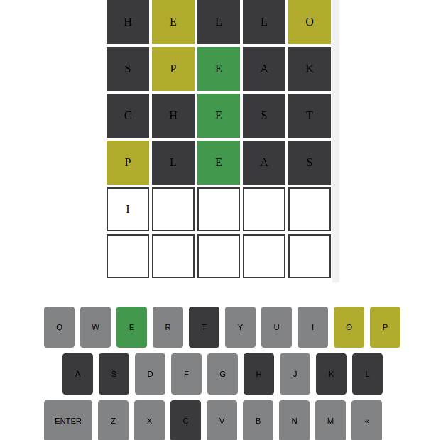

# ENDLESS WORDLE

We're all familiar with the popular web game wordle, well this is kinda like that but with a twist... it's endless. 
Meaning, you can have as many trials as you want till you get the answer.

## Technologies
1. HTML
2. CSS
3. JavaScript

## Contributing
Contributions are very welcome, just follow the following steps:
1. Clone this repo with the command <code>git clone https://github.com/Ken-mbira/endless_worlde.git</code>
2. Create your own branch locally and make the necessary changes.
3. Create a pull request from your branch and i'll be happy to take a look

## Installation
If you wish to have the project up and running on your local machine ...
1. Clone this repo with the command <code>git clone https://github.com/Ken-mbira/endless_worlde.git</code>
2. Then go live using your editor.
